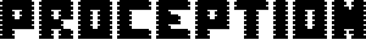

<h1></h1>

# About Proception AI

**Built Like a Machine. Works Like a Human.**

## Our Mission

We're developing **ProHand** - the new frontier of dexterity that achieves human-like precision in handling delicate objects and performing fine motor tasks. Where traditional robots can't, ProHand can.

## ProHand — The Future of Dexterity

Our flagship product, ProHand, represents a breakthrough in robotic manipulation with advanced features:

### 🎯 Precise Manipulation
- Achieve human-like precision in handling delicate objects
- Perform fine motor tasks with sub-millimeter accuracy

### 🤖 Adaptive Grip
- Intelligent grip control that adapts to object shape and size in real-time
- Automatic shape adaptation for different object types

### 🔄 Dynamic Movement
- Fluid, natural motion patterns that mimic human hand movements
- 20+ degrees of freedom for natural movement

> See details: https://www.proception.ai/hand

## Join Our Team

[>   We're not hiring. We're recruiting legends.  <](https://www.proception.ai/careers)

**Location:** Palo Alto, CA 94301, United States

 

